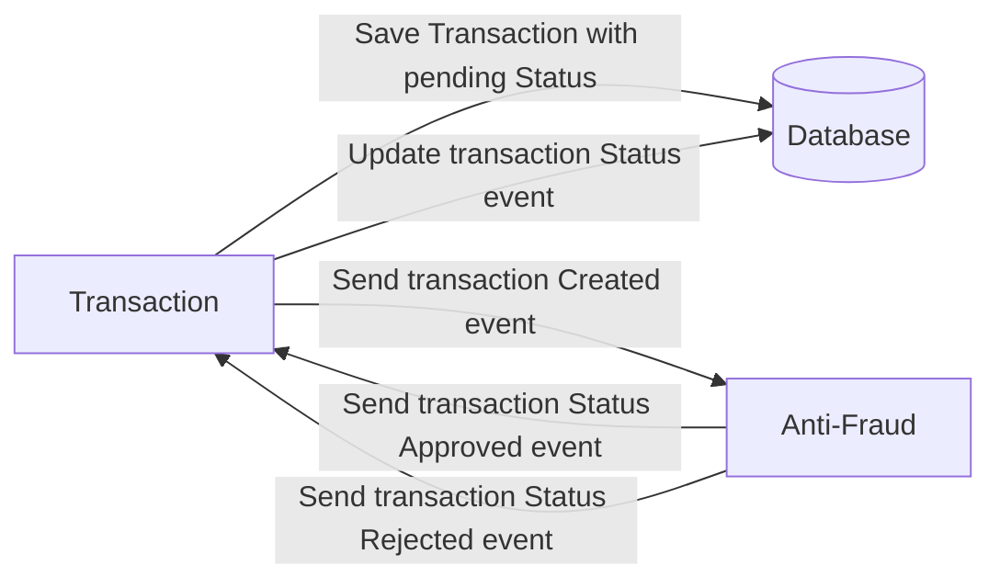

# Transaction Service – Yape Code Challenge

Este proyecto implementa un **microservicio de transacciones** desarrollado con **Spring Boot 3 - WEBFLUX**, siguiendo el enfoque de **Arquitectura Hexagonal (Ports & Adapters)** y un **flujo event-driven con Kafka**.


Todos los endpoints intercambian datos en **JSON** y el sistema está preparado para ejecutarse **localmente con Docker Compose**.

---

# Problem

Every time a financial transaction is created it must be validated by our anti-fraud microservice and then the same service sends a message back to update the transaction status.
For now, we have only three transaction statuses:

<ol>
  <li>pending</li>
  <li>approved</li>
  <li>rejected</li>  
</ol>

Every transaction with a value greater than 1000 should be rejected.


---

## Arquitectura

El proyecto sigue **Arquitectura Hexagonal**, separando claramente responsabilidades:

```
├── application
│   ├── dto
│   ├── service
│   └── usecase
├── domain
│   ├── model
│   └── port
├── infrastructure
│   ├── inbound
│   │   ├── rest
│   │   └── kafka
│   ├── outbound
│   │   ├── persistence
│   │   └── kafka
│   └── config
```

---
> [!TIP]
> **Sobre la estructura de repositorios separados:**  
> El servicio **Anti-Fraud** se gestiona en un repositorio independiente.  
> En un entorno real, cada microservicio tiene su propio ciclo de vida y equipo.  
> Para este challenge, se facilita la revisión incluyendo un paquete de despliegue unificado dentro de la carpeta `devops`.

## Ejecución local (sin Docker)

### Requisitos
- Java 17
- Maven 3.9+
- PostgreSQL
- Kafka + Zookeeper

### Compilar y ejecutar tests
```bash
mvn clean compile
mvn test
mvn verify
```

Reporte JaCoCo:
```
target/site/jacoco/index.html
```


##  Docker Compose (PostgreSQL + Kafka + Transaction Service + Antifraud)

### Requisitos
- Docker y Docker Compose

### 1) Construir el `.jar`
Desde la raíz del proyecto (donde está el `pom.xml`):

```bash
mvn clean package
```

El ejecutable jar se genera en:

```
target/transaction-service-0.0.1.jar
```

> Empaquetar mas pruebas unitarias & cobertura:
> ```bash
> mvn clean verify
> ```

## ***Antifraud Service***

El servicio de **Antifraud** se encuentra implementado en un repositorio independiente y
se integra con este microservicio mediante eventos Kafka.

Repositorio:
 https://github.com/alessandrojre/antifraud-service

En el entorno local, el `docker compose` levanta automáticamente este servicio para simular el flujo completo:
Transaction Service → Kafka → Antifraud Service → Kafka → Transaction Service.


## Levantar el ecosistema con Docker Compose
### Requisitos
- El archivo `antifraud-service-0.0.1.jar` debe existir en `devops/antifraud/`

Ubícate en la carpeta `devops` (donde está el `docker-compose.yml`) y ejecuta:

```bash
   ./up_all_services.sh
```
> Si tienes problemas de permisos:
```bash
   chmod +x up_all_services.sh
```

#### Windows
Si usas **Git Bash** (recomendado):
```bash
sh up_all_services.sh
```

Si usas **PowerShell o CMD**:
```bash
docker compose up -d --build
```

---

### 2) Detener y limpiar el entorno

#### Linux / macOS
```bash
./down_all_services.sh
```

#### Windows (Git Bash)
```bash
sh down_all_services.sh
```
> Si tienes problemas de permisos:
```bash
   chmod +x down_all_services.sh
```
---


Ver contenedores activos:

```bash
  docker ps
```
Para ver logs:

```bash
  docker compose logs -f
```
---

## Probar endpoints REST

### Crear transacción aprobada 
```bash
curl --location --request POST 'http://localhost:8080/transactions' \
--header 'Content-Type: application/json' \
--data-raw '{
  "accountExternalIdDebit": "11111111-1111-1111-1111-111111111111",
  "accountExternalIdCredit": "22222222-2222-2222-2222-222222222222",
  "transferTypeId": 1,
  "value": 150.75
}'
```

Response:
```json
{
  "transactionExternalId": "83a3d905-ee35-4201-9958-0fde4d7267b8"
}
```


### Crear transacción rechazada
```bash
curl --location --request POST 'http://localhost:8080/transactions' \
--header 'Content-Type: application/json' \
--data-raw '{
  "accountExternalIdDebit": "11111111-1111-1111-1111-111111111111",
  "accountExternalIdCredit": "22222222-2222-2222-2222-222222222222",
  "transferTypeId": 1,
  "value": 1500.00
}'
```

Response:
```json
{
  "transactionExternalId": "e65b68b9-b0a2-4f19-b816-ae226992601c"
}
```
---


### Obtener transacción por ID
```bash
curl --location --request GET \
'http://localhost:8080/transactions/{transactionExternalId}'
```

Response:
```json
{
  "transactionExternalId": "83a3d905-ee35-4201-9958-0fde4d7267b8",
  "transactionType": {
    "name": "TRANSFER"
  },
  "transactionStatus": {
    "name": "APPROVED"
  },
  "value": 150.75,
  "createdAt": "2025-12-29T00:00:00Z"
}
```

---

## Docker Compose

Levantar todo el entorno:
```bash
docker compose up --build
```
## o el siguiente comando ubicado en el directorio devops

```bash
   ./up_all_services.sh
```

Servicios:
- Transaction Service → 8080
- Antifraud Service → 8081
- PostgreSQL → 5432
- Kafka → 9092

---

##  Stack Tecnológico

- **Java 17** & **Spring Boot 3.5 (WebFlux)**
- **Project Reactor**: Manejo de flujos no bloqueantes (Mono/Flux).
- **R2DBC**: Driver de base de datos reactivo para PostgreSQL.
- **Kafka**: Mensajería asíncrona optimizada para alto volumen.
- **PostgreSQL**: Persistencia relacional.
- **Docker & Docker Compose**: Orquestación local.
- **JUnit 5 & JaCoCo**: Pruebas unitarias y cobertura de código.
